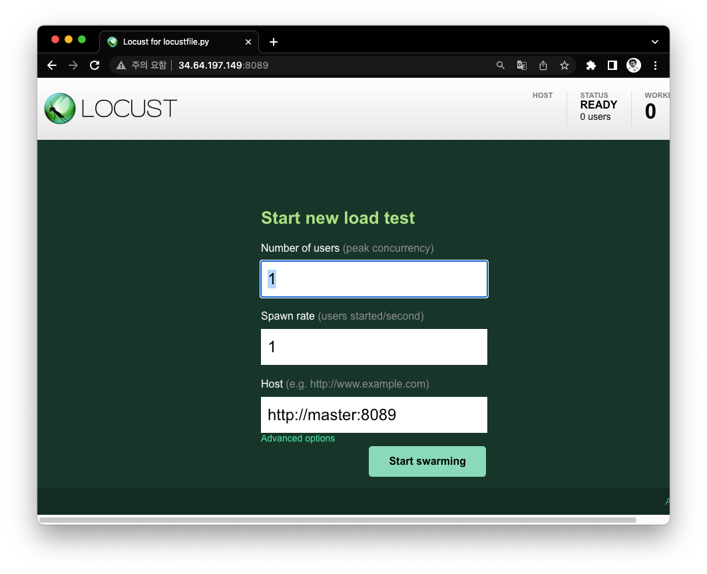
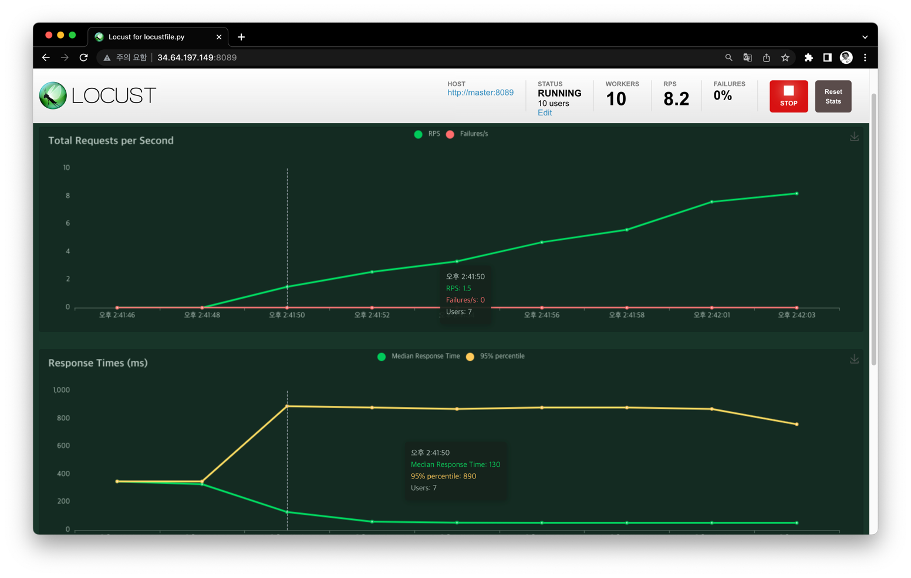

# Kafka distributed testing with Locust

This repository is for distributed testing simulation by using [locust framework](https://locust.io/).

## How to set up?

There are two versions:

### By using Docker container

If you want to execute this testing tool on your local machine, I strongly recommend you to use docker-based environment.

```shell
docker-compose up [-d]
```

* Kafka broker address: http://localhost:19092
* Kafka monitoring address(AKHQ): http://localhost:8080
* Locust master address: http://localhost:8089

### By using Kubernetes(a.k.a K8s)

For the prerequisite, you need to comfortable for using kubernetes. And you need to set up your own kubernetes cluster on your local machine or cloud environment.

* Execute kubernetes components.
    ```shell
    cd kubernetes/
    kubectl create namespace locust
    kubectl apply -f master.yaml -f worker.yaml
    ```
    The service object of locust master node is `LoadBalancer`. You need to check external IP address by `kubectl get svc -n locust` command.
  

* Scale-up the number of locust workers.

    The default number of locust worker is just 1. If you want to test for large-scale environment, you want to scale-up worker node by using the following command. 
    ```shell
    kubectl scale deploy worker -n locust --replicas=<scale you want>
    ```

## How to execute locust testing framework?

If you successfully compose your testing environment with docker or kubernetes, visit the locust master address via your local browser.



Depending on the scale you want to test, you can adjust following features:
* Number of users: literally the number of users you want to build concurrently.
* Spawn rate: spawning rate of users.



If you click "Start swarming" button on your master node UI, you can see the chart of RPS(request per second) and RT(response time).
